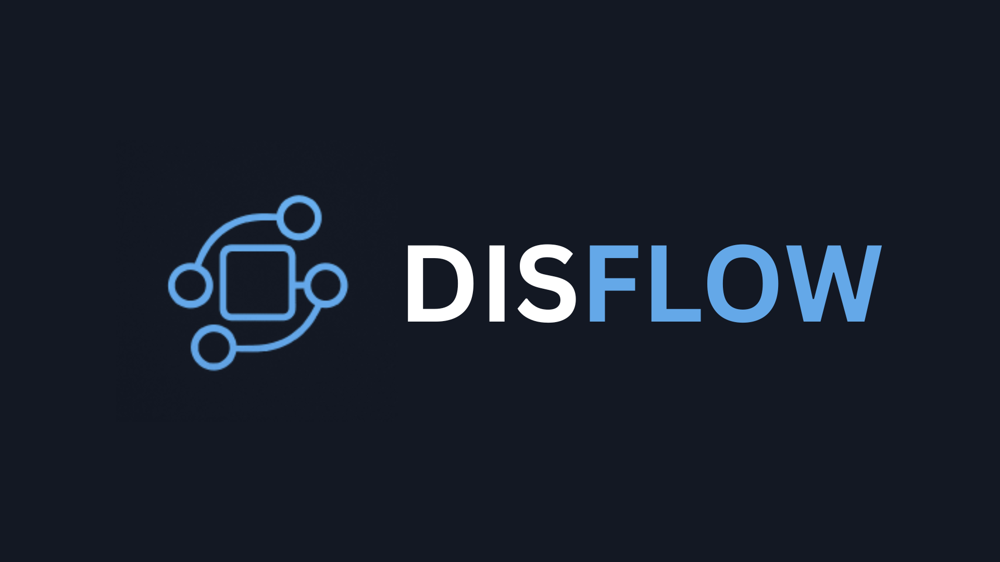

<div align="center">
  <p>
    
  </p>
  <h1>Graph, Flow, Ship</h1>
  <p>
    
    
  </p>
</div>

## About

DisFlow is a Discord App creation tool that empowers non-developers to build Discord applications using an intuitive, visual node-based editor. By connecting nodes in a graph, users can create complex logic flows that generate JavaScript code for Discord bots and integrations.

## Features

- **Visual Node-Based Editor**: Powered by [litegraph.js](https://github.com/jagenjo/litegraph.js/) for an intuitive drag-and-drop experience
- **Code Generation**: Automatically generates JavaScript code from visual graphs
- **Extensible Node Library**: Includes nodes for Console operations, Control flow, Math functions, String manipulation, and Variables
- **Web-Based Application**: Built with SvelteKit for a modern, responsive user interface
- **Monorepo Structure**: Organized with Turbo for efficient development and building

## Installation

### Prerequisites

- Node.js (version 18 or higher)
- Yarn package manager

### Setup

1. **Clone the repository:**
   ```bash
   git clone https://github.com/DisFlowTeam/disflow.git
   cd disflow
   ```

2. **Install dependencies:**
   ```bash
   yarn install
   ```

3. **Build the packages:**
   ```bash
   yarn build:packages
   ```

4. **Start the development server:**
   ```bash
   yarn dev
   ```

The web application will be available at `http://localhost:5173` (default Vite port).

## Usage

1. Open the DisFlow web application in your browser
2. Use the visual editor to create your Discord app logic by dragging and connecting nodes
3. Configure node properties as needed
4. Generate JavaScript code from your graph
5. Deploy the generated code to your Discord bot or application

### Available Node Types

- **Console**: Print, Clear Console, Input, Throw Error
- **Control**: If statements, While loops, Boolean operations, Comparisons
- **Math**: Numbers, Operations, Functions, Random numbers, Rounding
- **Strings**: Text creation, manipulation, searching, and formatting
- **Variables**: Create, set, and reference variables

* More node types to be added in the future

## Project Structure

- [`apps/web-application/`](apps/web-application/) - SvelteKit frontend application with the visual editor
- [`packages/generator/`](packages/generator/) - Code generation module that extends litegraph.js capabilities. Please view its [README](packages/generator/README.md) if you would like to develop nodes for DisFlow or adapt the generator into your own litegraph applications
- [`packages/utils/`](packages/utils/) - Shared utility functions and workspace management tools
- [`packages/tsconfig/`](packages/tsconfig/) - Shared TypeScript configuration for consistent builds

## Development

### Scripts

- `yarn build` - Build all packages and applications
- `yarn dev` - Start development mode (builds packages and starts web app)
- `yarn test` - Run tests across all workspaces
- `yarn format-and-lint` - Run biome to check files for formatting and linting errors
- `yarn format-and-lint:fix` - Run biome to check *and fix* formatting and linting errors when it can

### Building Packages

To build individual packages:

```bash
yarn workspace @disflow-team/code-gen build
yarn workspace @disflow-team/utils build
```

## Contributing

We welcome contributions! Please follow these steps:

1. Fork the repository
2. Create a feature branch (`git checkout -b feature/amazing-feature`)
3. Commit your changes (`git commit -m 'Add amazing feature'`)
4. Push to the branch (`git push origin feature/amazing-feature`)
5. Open a Pull Request

## Support

If you have questions or need help:

- Open an issue on GitHub
- Join our Discord community (link coming soon)
- Check the documentation (coming soon)

